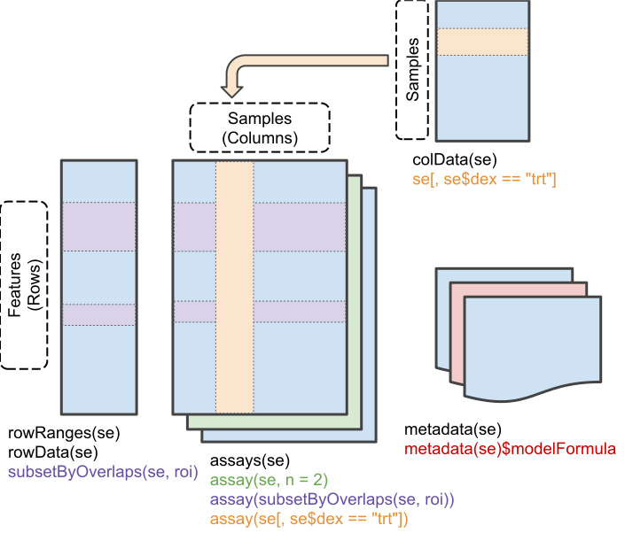
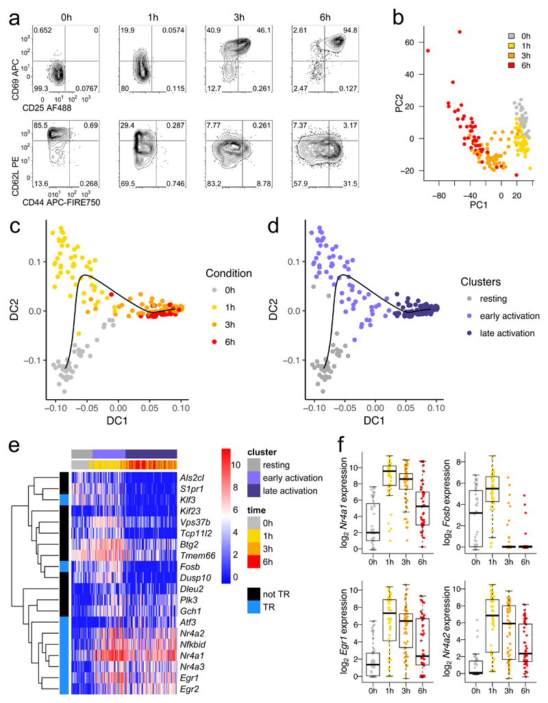
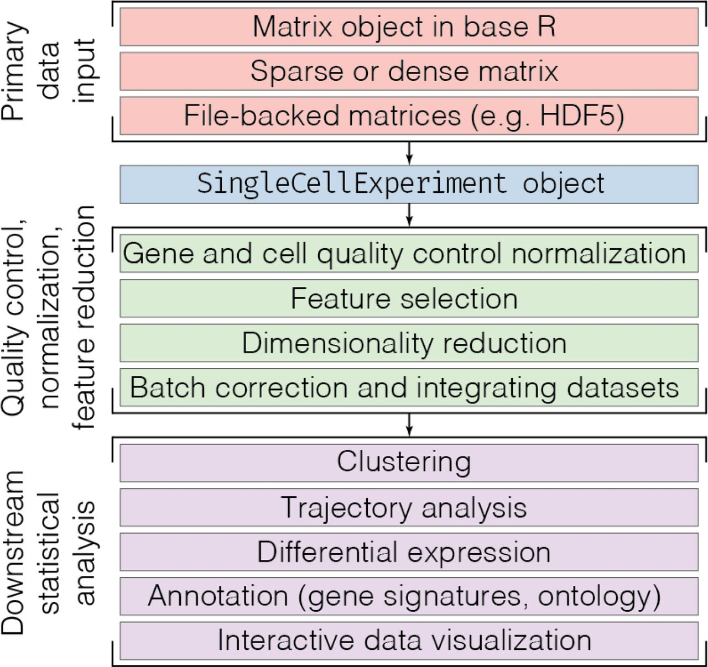

```{r, echo=FALSE}
knitr::opts_chunk$set(cache = TRUE, collapse = TRUE)
```

# Objectives

Abstract: This two-hour workshop is meant to empower Cancer Moonshot
research labs to tackle their bioinformatic analysis challenges. For
the first hour and a half, we’ll work through a hands-on workflow for
single cell assay analysis. We’ll introduce data import, management,
and interactive visualization using Bioconductor tools like
iSEE. After seeing how to work with one assay, we’ll briefly explore
approaches to integrating different assays. In the final ½ hour we’ll
go beyond Bioconductor tools for single-cell analysis. We’ll assemble
a panel to discuss possible strategies for data analysis challenges
submitted (before the workshop) to the organizers.

Goal: Empower Cancer Moonshot Research Labs to tackle their
bioinformatic analysis challenges

Objectives, this workshop:

1. Learn the basics of _R_ and _Bioconductor_
2. Participate in the exploration of immuno-oncology relevant data using _R_ /
   _Bioconductor_
3. Tour additional directions possible in _R_ / _Bioconductor_
4. Discuss challenges and opportunities in immuno-oncology bioinformatics.

# _R_ and _Bioconductor_ 101

## _R_

**What we will learn**

- Working with _R_ functions, variables, vectors and data structures
- Using packages to extend base _R_ capabilities
- Getting help

_R_

- standard and advanced statistical analysis
- high quality visualizations
- interactivity

Vectors, variables, and functions

```{r}
x = rnorm(100)
mean(x)
var(x)
hist(x)
```

Manageing data: classes and methods

```{r, fig.asp = 1}
y = x + rnorm(100)
df = data.frame(x, y)
plot(y ~ x, df)
```

Visualization

```{r, fig.asp = 1}
fit = lm(y ~ x, df)
anova(fit)
plot(y ~ x, df)
abline(fit)
```

Extending base R: packages

```{r, message=FALSE, fig.asp = 1}
library(ggplot2)
ggplot(df, aes(x, y)) + 
    geom_point() +
    geom_smooth(method="lm")
```

CRAN (Comprehensive _R_ Archive Network)

- 15000+ R packages: https://cran.r-project.org/web/packages
- Task views: https://cran.r-project.org/web/views

Help!

- `?lm`
- `browseVignettes("ggplot2")` / `vignette(package="ggplot2")`

**What we learned**

- Vectors simplify _R_ expressions
- Structures like `data.frame` help manage data
- Packages provide many different extensions
- Help is available through `?`, `browseVignettes()` and other means

## _Bioconductor_

**What we will learn**

- Discover and use _Bioconductor_ packages
- Work with `SummarizedExperiment` for data management
- Use annotation packages to map between gene identifiers

_Bioconductor_

- More than 1800 _R_ packages for statistical analysis and comprehension of
  high-throughput genomic data
- Bulk and single-cell RNA-seq, epigenetic and other microarrays, called
  variants, flow cytometry, proteomics, ...
- Widely used (>1/2 million unique IP downloads / year), highly cited
  (>33,000 PubMedCentral citations), well-respected
- NIH funded -- NHGRI (core, cloud), ITCR (multi-assay, annotation-
  and experiment-hub), IOTN (immuno-oncology data coordinating center)

Resources

- Project: https://bioconductor.org
- 1823 Packages: https://bioconductor.org/packages
    - Vignettes (e.g., [DESeq2][])
    - Software, annotation, and experiment (exemplar) data packages
- Support: https://support.bioconductor.org
- [Workflows][], [training material][], [slack][] ([join][]), etc.

[DESeq2]: http://bioconductor.org/packages/release/bioc/vignettes/DESeq2/inst/doc/DESeq2.html
[Workflows]: https://bioconductor.org/packages/release/BiocViews.html#___Workflow
[training material]: https://bioconductor.org/help/course-materials/
[slack]: https://community-bioc.slack.com/
[join]: https://bioc-community.herokuapp.com/

Data management

- Extensive resources to import and operate on standard file formats,
  e.g. BED, VCF, BAM, ...

Domain-specific work flows, e.g., bulk RNA-seq diffrential expression

- Load example data, pre-formatted.

```{r, message = FALSE}
library(airway)
data(airway)      # load example data
airway
```

- A _Bioconductor_ _SummarizedExperiment_ object, providing coordinated data
  management
  
```{r, echo=FALSE}

```

- `colData()`: description of samples, especially four cell lines exposed to
  two dexamethasone treatments

```{r}
colData(airway)

airway$cell
```

- `assay()` data: RNA-seq reads overlapping genes (proxy for gene expression)

```{r}
head(assay(airway))
```

- Load package implementing domain-specific work flow (i.e., bulk RNA-seq
  differential expression)
- Fit a model describing counts as a function of cell line (blocking
  variable) and dexamethasone treatment.
- Obtain a 'top table' of differentially expressed genes

```{r, message=FALSE, collapse=TRUE}
library(DESeq2)   # 'Software' package -- bulk RNA-seq differential expression
dds = DESeqDataSet(airway, ~ cell + dex)
fit = DESeq(dds)
toptable = results(fit)
toptable
```

- Find resources to map between identifiers using AnnotationHub

```{r, message = FALSE}
library(AnnotationHub)
query(AnnotationHub(), c("EnsDb", "Homo sapiens", "98"))
ensdb <- AnnotationHub()[["AH75011"]]
```

- Map from Ensembl identifiers to gene symbol; add the annotation to
  both the top table and airway data sets

```{r, message = FALSE, collapse = TRUE}
egids <- rownames(toptable)
toptable$SYMBOL <- mapIds(ensdb, egids, "SYMBOL", "GENEID")
rowData(airway)$SYMBOL <- toptable$SYMBOL
```

- Most differentially expressed genes

```{r}
idx <- head( order( toptable$padj), 20 )
toptable[idx, c("SYMBOL", "padj")]
```

- Heat map

```{r}
heatmap( log1p( assay(airway)[idx,] ))
```

- More user-friendly heatmap, with Ensembl row namess replaced by
  symbols.

```{r}
m <- assay(airway)[idx,]
rownames(m) <- rowData(airway)$SYMBOL[idx]
heatmap( log1p( m ))
```

**What we learned**

- https://bioconductor.org is the entry point for high-throughput
  genomic analysis in _R_.
- `SummarizedExperiment` allows easy management of complicated
  data. Use functions like `colData()`, `assay()`, and `[` for
  manipulation.
- AnnotationHub provides resources for mapping between
  identifiers. Use `query()` to discover common resources.

# Immuno-oncology analysis: single-cell RNAseq

**What we will do**

- Recreate figures from a recent paper, illustrating how some ideas in
  single-cell analysis translate into analysis.
- Survey other options for single cell and multi-omic analysis
  available in _R_ / _Bioconductor_

An excellent resource -- osca --

- https://osca.bioconductor.org/

For today's workshop

- Richard, A. C., A. T. L. Lun, W. W. Y. Lau, B. Gottgens, J. C. Marioni, and G.
  M. Griffiths. 2018. "T cell cytolytic capacity is independent of initial
  stimulation strength." [Nat. Immunol. 19 (8):849–58][PMC6300116].

[PMC6300116]: https://www.ncbi.nlm.nih.gov/pmc/articles/PMC6300116/

Goal: reproduce parts of [Figure 1][].

[Figure 1]: https://www.ncbi.nlm.nih.gov/pmc/articles/PMC6300116/figure/F1/?report=objectonly

```{r, echo=FALSE}

```

Our part in the big picture (from Amezquita et al., Orchestrating
Single-Cell Analysis with Bioconductor bioRxiv [590562][])

[590562]: https://doi.org/10.1101/590562

```{r, echo=FALSE}

```

## Filtering, normalization, and selecting subsets-of-interest

Packages we'll use

- [scRNAseq][]: Access to select scRNA-seq data sets
- [SingleCellExperiment][]: Data representation
- [scater][]: Single-cell analysis toolkit -- normalization
- [AnnotationHub][], [ensembldb][]: Annotation
- [destiny][]: Psuedotime.
- [dplyr][]: 'tidy' data management.
- [ggplot2][]: Visualization
- Base R: filtering & data management

[scRNAseq]: https://bioconductor.org/packages/scRNAseq
[SingleCellExperiment]: https://bioconductor.org/packages/SingleCellExperiment
[scater]: https://bioconductor.org/packages/scater
[AnnotationHub]: https://bioconductor.org/packages/AnnotationHub
[ensembldb]: https://bioconductor.org/packages/ensembldb
[destiny]: https://bioconductor.org/packages/destiny
[dplyr]: https://cran.r-project.org/package=dplyr
[ggplot2]: https://cran.r-project.org/package=ggplot2

```{r, message=FALSE}
library(scRNAseq)
library(SingleCellExperiment)
library(scater)
library(AnnotationHub)
library(ensembldb)
library(destiny)
library(dplyr)
library(ggplot2)
```

Example data set

- Available via ExperimentHub and [scRNAseq][] package
- Specialized version of SummarizedExperiment

```{r, message=FALSE}
tcell = RichardTCellData()
tcell
```

Filtering

- 'informative' (often expressed) across cells

```{r}
## Expression in at least 5% of cells...
drop_filter <- rowSums(assay(tcell) > 0) >= (ncol(tcell) * 0.05)
tcell <- tcell[drop_filter,]

## ...and mean count at least 1
mean_filter <- rowMeans(assay(tcell)) >= 1
tcell <- tcell[mean_filter,]
```

Normalization

```{r, message=FALSE}
tcell <- logNormCounts(tcell)
```

Cells of interest -- time course

- What experimental treatments do we have?

[dplyr]: https://cran.r-project.org/package=dplyr

```{r, message=FALSE}
as_tibble(colData(tcell)) %>%
    dplyr::filter(post.analysis.well.quality == "pass") %>%
    dplyr::count(individual, stimulus, time)
```

- Subset `tcell` to contain only the samples of interest, and
  expressed genes with non-zero read counts across samples.

```{r}
stimulus <- c("OT-I high affinity peptide N4 (SIINFEKL)", "unstimulated")
cells_of_interest <- 
    ( tcell$stimulus %in% stimulus ) &
    ( tcell$`post-analysis well quality` %in% "pass" )

expressed_genes <- rowSums(logcounts(tcell)[, cells_of_interest]) != 0

fig1 <- tcell[expressed_genes, cells_of_interest]
```

- Some basic properties and manipulations

```{r, collpase = TRUE}
mean(logcounts(fig1) == 0)         # proportion of 0's

## update colData -- treat `time` as factor (discrete) rather than continuous
colData(fig1)$time <- factor(colData(fig1)$time)

## Save useful row-wise summaries
rowData(fig1)$ave_count <- rowMeans(assay(fig1))
rowData(fig1)$n_cells <- rowSums(assay(fig1) > 0)
```

## Visualization -- 'looking at' the data

Dimensionality reduction

- Add reduced dimension information to `fig1`

```{r}
fig1 <- runPCA(fig1, ncomponents = 4)
fig1 <- runTSNE(fig1)
fig1
```

- Visualize

```{r, collapse = TRUE, fig.asp = 1}
plotPCA(fig1, colour_by = "time", point_size = 4)
plotTSNE(fig1, colour_by = "time", point_size = 4)
```

Our favorite genes

- Use an 'annotation resource' to map between unfriendly Ensembl gene
  identifiers and more familiar gene symbols
- Discover and retrieve available resources -- an `EnsDb` (Ensembl data base) 
  for _Mus musculus_, Ensembl release 98

```{r, message=FALSE}
query(AnnotationHub(), c("EnsDb", "Mus musculus", "98"))
ensdb <- AnnotationHub()[["AH75036"]]
```

- Map all Ensembl gene identifiers to gene symbol, adding a row annotation to
  `fig1`

```{r}
rowData(fig1)$SYMBOL <- mapIds(ensdb, rownames(fig1), "SYMBOL", "GENEID")
```

- Boxplot of expression in a favorite gene

```{r, fig.asp=1}
rows <- rowData(fig1)$SYMBOL %in% "Nr4a1"
tbl <- tibble(
    time = fig1$time,
    Nr4a1 = logcounts(fig1)[rows,]
)

ggplot(tbl, aes(time, Nr4a1, color = time)) +
    geom_boxplot() +
    geom_jitter(width = .1)
```

**What we learned**

- Analyses use several different packages from _R_ and
  _Bioconductor_.
- Alot of effort is spent organizing data into appropriate formats for
  input to functions, and reshaping outputs of one function for the
  next step in the analysis.
- _Bioconductor_ data structures like `SummarizedExperiment` help
  substantially with these data managment tasks.
- Vignettes, resources like [osca][], and well-documented methods in
  published papers help orient us as we tackle new projects.

[osca]: https://osca.bioconductor.org/

## Further analysis

https://osca.bioconductor.org

- Quality control
- Normalization
- Feature selection
- Dimensionality reduction
- Clustering
- Marker gene detection
- Cell type annotation ([SingleR][]) (this package has a great
  vignette!)
- Trajectory analysis ([destiny][])
- Gene set enrichment
- Etc.!

[SingleR]: https://bioconductor.org/packages/SingleR
[destiny]: https://bioconductor.org/packages/destiny

## Interactive visualization

- See the [iSEE vignette][]

[iSEE vignette]: https://bioconductor.org/packages/release/bioc/vignettes/iSEE/inst/doc/basic.html

```{r iSEE, eval = FALSE}
iSEE::iSEE(fig1)
```

# Next steps

## Multi-omic analysis

- Coordinated management of multiple genetic data types
- See the [MultiAssayExperiment vignette][] for deails

[MultiAssayExperiment vignette]: https://bioconductor.org/packages/release/bioc/vignettes/MultiAssayExperiment/inst/doc/MultiAssayExperiment.html

- Available data types

```{r, message=FALSE}
library(MultiAssayExperiment)
library(curatedTCGAData)
curatedTCGAData()
```

- Particular data -- Breast cancer (BRCA) mutation, gene expression, and
  protein expression data.

```{r, message=FALSE}
assays = c("Mutation", "RNASeqGene", "RPPAArray")
brca = curatedTCGAData("BRCA", assays, dry.run = FALSE)
brca
```

- Each assay is a 'familiar' object, e.g., a SummarizedExperiment

```{r}
brca[["BRCA_RNASeqGene-20160128"]]
```

- Lots of annotations on each sample

```{r}
length(colnames(colData(brca)))
head(colnames(colData(brca)))
```

- Commands to aid management of overlapping samples across assays

## Computational clouds

- E.g., the [AnVIL][] NIH / NHGRI cloud resource
- Access to large scale data resources (1000 genomes, GTEx, CCDG, eMERGE, ...)
- Hosted computation via notebooks, including R / Bioconductor
- Coming soon: RStudio!

[AnVIL]: https://anvil.terra.bio/

## Learning more

- https://bioconductor.org
- https://bioconductor.org/help/course-materials
- Bioconductor [Asia][] Conference, Sydney, December 5 - 6
- Bioconductor [Europe][] Conference, Brussels, December 9 - 11.
- Bioconductor [North America][] Conference, Boston, July 29 - 31.

[Asia]: https://bioconductor.github.io/BiocAsia/
[Europe]: https://eurobioc2019.bioconductor.org/
[North America]: https://bioc2020.bioconductor.org

# Acknowledgements

Research reported in this presentation was supported by the NCIA and
NHGRI of the National Institutes of Health under award numbers
U24CA232979, U41HG004059, and U24CA180996.  The content is solely the
responsibility of the authors and does not necessarily represent the
official views of the National Institutes of Health.

```{r sessionInfo}
sessionInfo()
```
