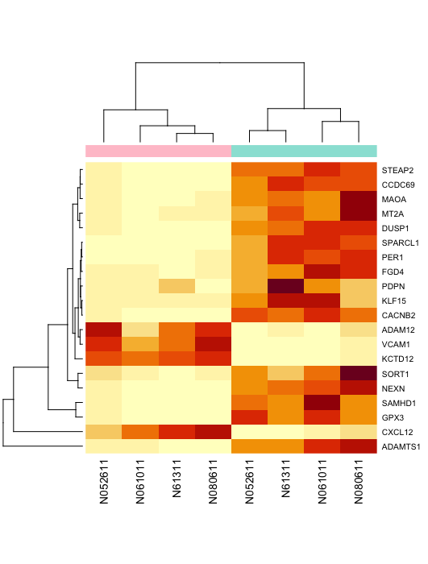

# Introduction

Description: This workshop will introduce you to the _Bioconductor_
collection of R packages for statistical analysis and comprehension of
high-throughput genomic data. The emphasis is on data exploration,
using RNA-sequence gene expression experiments as a motivating
example. How can I access common sequence data formats from R? How can
I use information about gene models or gene annotations in my
analysis? How do the properties of my data influence the statistical
analyses I should perform? What common workflows can I perform with R
and _Bioconductor_? How do I deal with very large data sets in R?
These are the sorts of questions that will be tackled in this
workshop.

Requirements: You will need to bring your own laptop. The workshop
will use cloud-based resources, so your laptop will need a web browser
and WiFi capabilities. Participants should have used _R_ and _RStudio_ for
tasks such as those covered in introductory workshops earlier in the
week. Some knowledge of the biology of gene expression and of concepts
learned in a first course in statistics will be helpful.

Relevance: This workshop is relevant to anyone eager to explore
genomic data in _R_. The workshop will help connect ‘core’ _R_ concepts
for working with data (e.g., data management via data.frame(),
statistical modelling with lm() or t.test(), visualization usiing
plot() or ggplot()) to the special challenges of working with large
genomic data sets. It will be especially helpful to those who have or
will have their own genomic data, and are interested in more fully
understanding how to work with it in _R_.

```{r, echo=FALSE}
knitr::opts_chunk$set(cache = TRUE, collapse = TRUE)
```

# Our goal

```{r, echo=FALSE}

```

# Data gathering, input, representation, and cleaning

```{r}
samples <- read.table("../inst/extdata/samples.tsv")
samples$dex <- relevel(samples$dex, "untrt")
```

```{r}
counts <- read.table("../inst/extdata/counts.tsv")
counts <- as.matrix(counts)
```

```{r}
url <- "ftp://ftp.ensembl.org/pub/release-75/gtf/homo_sapiens/Homo_sapiens.GRCh37.75.gtf.gz"
```

```{r, message = FALSE}
library(BiocFileCache)
```

```{r}
gtfpath <- bfcrpath(rnames = url)
```

```{r, message = FALSE}
library(rtracklayer)
```

```{r}
gtf <- import(gtfpath)
rowidx <- gtf$type == "gene"
colidx <- c("gene_id", "gene_name", "gene_biotype")
genes <- gtf[rowidx, colidx]
names(genes) <- genes$gene_id
genes$gene_id <- NULL
```

# Coordinated data management

```{r, message = FALSE}
library(SummarizedExperiment)
```

```{r}
samples <- samples[colnames(counts),]
genes <- genes[rownames(counts),]
se <- SummarizedExperiment(
  assays = list(counts = counts), 
  rowRanges = genes, colData = samples
)
```

# Analysis and visualzation

```{r, message = FALSE}
library(DESeq2)
```

```{r}
dds <- DESeqDataSet(se, ~ cell + dex)
fit <- DESeq(dds)
destats <- results(fit)
```

```{r}
rowData(se) <- cbind(rowData(se), destats)
```

```{r}
top20idx <- head( order(rowData(se)$padj), 20)
top20 <- se[top20idx,]
heatmap(assay(top20))
```

```{r}
m <- assay(top20)
rownames(m) <- rowData(top20)$gene_name
trtcolor <- hcl.colors(2, "Pastel 1")[ colData(top20)$dex ]
heatmap(m, ColSideColors = trtcolor)
```

# Acknowledgements

```{r sessionInfo, echo=FALSE}
sessionInfo()
```
