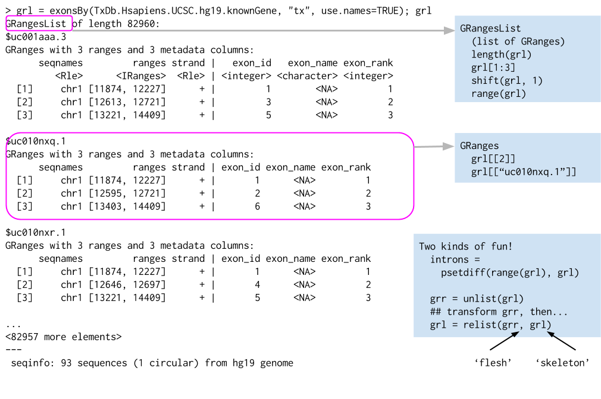

```{r style, echo = FALSE, results = 'asis'}
knitr::opts_chunk$set(
    eval=as.logical(Sys.getenv("KNITR_EVAL", "TRUE")),
    cache=as.logical(Sys.getenv("KNITR_CACHE", "TRUE"))
)
options(width = 75)
```

# Core infrastructure

## S4 Objects

Why?

- Interoperability
- Robustness

What?

- _Interface_ (what you want to know about) and _implementation_ (what
  you don't want to know about!)
  
```{r, message = FALSE}
library(Biostrings)
```
```{r}
head( methods(class = "DNAStringSet") )
methods(generic = "reverseComplement")
```

- Caveats

## _Biostrings_

DNA, amino acid, and other biological sequences. See earlier example
in [01: Introdction to R and Bioconductor][].

## _GRanges_

### The [GenomicRanges][] package

- `GRanges()`: genomic coordinates to represent annotations (exons,
  genes, regulatory marks, ...) and data (called peaks, variants,
  aligned reads)

    

- `GRangesList()`: genomic coordinates grouped into list elements
  (e.g., paired-end reads; exons grouped by transcript)

    

### Range operations


#### Ranges

- IRanges
    - `start()` / `end()` / `width()`
    - List-like -- `length()`, subset, etc.
    - 'metadata', `mcols()`
- GRanges
    - 'seqnames' (chromosome), 'strand'
    - `Seqinfo`, including `seqlevels` and `seqlengths`

#### Intra-range methods

- Independent of other ranges in the same object
- GRanges variants strand-aware
- `shift()`, `narrow()`, `flank()`, `promoters()`, `resize()`,
  `restrict()`, `trim()`
- See `?"intra-range-methods"`

#### Inter-range methods

- Depends on other ranges in the same object
- `range()`, `reduce()`, `gaps()`, `disjoin()`
- `coverage()` (!)
- see `?"inter-range-methods"`

#### Between-range methods

- Functions of two (or more) range objects
- `findOverlaps()`, `countOverlaps()`, ..., `%over%`, `%within%`,
  `%outside%`; `union()`, `intersect()`, `setdiff()`, `punion()`,
  `pintersect()`, `psetdiff()`

#### Example

```{r, message=FALSE}
library(GenomicRanges)
```
```{r}
gr <- GRanges("A", IRanges(c(10, 20, 22), width=5), "+")
shift(gr, 1)                            # intra-range
range(gr)                               # inter-range
reduce(gr)                              # inter-range
snps <- GRanges("A", IRanges(c(11, 17, 24), width=1))
findOverlaps(snps, gr)                  # between-range
setdiff(range(gr), gr)                  # 'introns'
```

## _GenomicAlignments_

Representation of aligned reads. See exercises below.

## _SummarizedExperiment_

### The [SummarizedExperiment][] package


- Coordinate feature x sample 'assays' with row (feature) and column
  (sample) descriptions.
- `colData()` data frame for desciption of samples
- `rowRanges()` _GRanges_ / _GRangeList_ or data frame for description
  of features
- `exptData()` to describe the entire object
- `assays()` can be any matrix-like object, including very large
  on-disk representations such as [HDF5Array][]

```{r SummarizedExperiment, message = FALSE}
library(SummarizedExperiment)
library(airway)
```
```{r}
data(airway)
airway
colData(airway)
head(assay(airway))
airway[, airway$dex %in% "trt"]
chr14 <- as(seqinfo(rowRanges(airway)), "GRanges")["14"]
airway[airway %over% chr14,]
```

The object allows very easy access to the assay, for instance to
determine library size (total number of mapped reads in each sample)

```{r}
colSums(assay(airway))
```

and average log count number across genes with non-zero counts

```{r, message=FALSE}
library(ggplot2)
```

```{r}
ridx <- rowSums(assay(airway)) > 0
se <- airway[ridx,]
ave_log_expr <- rowMeans(log(1 + assay(se)))
tbl <- tibble::enframe(ave_log_expr, "gene", "ave_log_expr")
ggplot(tbl, aes(ave_log_expr)) + geom_density()
```

# From files to _Bioconductor_ objects

## BED, GFF, GTF, WIG import and export

- Genome annotations: BED, WIG, GTF, etc. files. E.g., GTF:

- Component coordinates

        7   protein_coding  gene        27221129    27224842    .   -   . ...
        ...
        7   protein_coding  transcript  27221134    27224835    .   -   . ...
        7   protein_coding  exon        27224055    27224835    .   -   . ...
        7   protein_coding  CDS         27224055    27224763    .   -   0 ...
        7   protein_coding  start_codon 27224761    27224763    .   -   0 ...
        7   protein_coding  exon        27221134    27222647    .   -   . ...
        7   protein_coding  CDS         27222418    27222647    .   -   2 ...
        7   protein_coding  stop_codon  27222415    27222417    .   -   0 ...
        7   protein_coding  UTR         27224764    27224835    .   -   . ...
        7   protein_coding  UTR         27221134    27222414    .   -   . ...

- Annotations

        gene_id "ENSG00000005073"; gene_name "HOXA11"; gene_source "ensembl_havana"; gene_biotype "protein_coding";
        ...
        ... transcript_id "ENST00000006015"; transcript_name "HOXA11-001"; transcript_source "ensembl_havana"; tag "CCDS"; ccds_id "CCDS5411";
        ... exon_number "1"; exon_id "ENSE00001147062";
        ... exon_number "1"; protein_id "ENSP00000006015";
        ... exon_number "1";
        ... exon_number "2"; exon_id "ENSE00002099557";
        ... exon_number "2"; protein_id "ENSP00000006015";
        ... exon_number "2";
        ...

### The [rtracklayer][] package

- `import()`: import various formats to `GRanges` and similar instances
- `export()`: transform from `GRanges` and similar types to BED, GTF, ...
- Also, functions to interactively drive UCSC genome browser with data
  from _R_ / _Bioconductor_

## FASTQ files

- Sequenced reads: FASTQ files

        @ERR127302.1703 HWI-EAS350_0441:1:1:1460:19184#0/1
        CCTGAGTGAAGCTGATCTTGATCTACGAAGAGAGATAGATCTTGATCGTCGAGGAGATGCTGACCTTGACCT
        +
        HHGHHGHHHHHHHHDGG<GDGGE@GDGGD<?B8??ADAD<BE@EE8EGDGA3CB85*,77@>>CE?=896=:
        @ERR127302.1704 HWI-EAS350_0441:1:1:1460:16861#0/1
        GCGGTATGCTGGAAGGTGCTCGAATGGAGAGCGCCAGCGCCCCGGCGCTGAGCCGCAGCCTCAGGTCCGCCC
        +
        DE?DD>ED4>EEE>DE8EEEDE8B?EB<@3;BA79?,881B?@73;1?########################

### The [ShortRead][] package

- `readFastq()`: input
- `FastqStreamer()`: iterate through FASTQ files
- `FastqSampler()`: sample from FASTQ files, e.g., for quality assessment
- Functions for trimming and filters FASTQ files, QA assessment

## Aligned reads

- Aligned reads: BAM files

- Header

        @HD     VN:1.0  SO:coordinate
        @SQ     SN:chr1 LN:249250621
        @SQ     SN:chr10        LN:135534747
        @SQ     SN:chr11        LN:135006516
        ...
        @SQ     SN:chrY LN:59373566
        @PG     ID:TopHat       VN:2.0.8b       CL:/home/hpages/tophat-2.0.8b.Linux_x86_64/tophat --mate-inner-dist 150 --solexa-quals --max-multihits 5 --no-discordant --no-mixed --coverage-search --microexon-search --library-type fr-unstranded --num-threads 2 --output-dir tophat2_out/ERR127306 /home/hpages/bowtie2-2.1.0/indexes/hg19 fastq/ERR127306_1.fastq fastq/ERR127306_2.fastq

- Alignments: ID, flag, alignment and mate

        ERR127306.7941162       403     chr14   19653689        3       72M             =       19652348        -1413  ...
        ERR127306.22648137      145     chr14   19653692        1       72M             =       19650044        -3720  ...
        ERR127306.933914        339     chr14   19653707        1       66M120N6M       =       19653686        -213   ...

- Alignments: sequence and quality

        ... GAATTGATCAGTCTCATCTGAGAGTAACTTTGTACCCATCACTGATTCCTTCTGAGACTGCCTCCACTTCCC        *'%%%%%#&&%''#'&%%%)&&%%$%%'%%'&*****$))$)'')'%)))&)%%%%$'%%%%&"))'')%))
        ... TTGATCAGTCTCATCTGAGAGTAACTTTGTACCCATCACTGATTCCTTCTGAGACTGCCTCCACTTCCCCAG        '**)****)*'*&*********('&)****&***(**')))())%)))&)))*')&***********)****
        ... TGAGAGTAACTTTGTACCCATCACTGATTCCTTCTGAGACTGCCTCCACTTCCCCAGCAGCCTCTGGTTTCT        '******&%)&)))&")')'')'*((******&)&'')'))$))'')&))$)**&&****************

- Alignments: Tags

        ... AS:i:0  XN:i:0  XM:i:0  XO:i:0  XG:i:0  NM:i:0  MD:Z:72 YT:Z:UU NH:i:2  CC:Z:chr22      CP:i:16189276   HI:i:0
        ... AS:i:0  XN:i:0  XM:i:0  XO:i:0  XG:i:0  NM:i:0  MD:Z:72 YT:Z:UU NH:i:3  CC:Z:=  CP:i:19921600   HI:i:0
        ... AS:i:0  XN:i:0  XM:i:0  XO:i:0  XG:i:0  NM:i:4  MD:Z:72 YT:Z:UU XS:A:+  NH:i:3  CC:Z:=  CP:i:19921465   HI:i:0
        ... AS:i:0  XN:i:0  XM:i:0  XO:i:0  XG:i:0  NM:i:4  MD:Z:72 YT:Z:UU XS:A:+  NH:i:2  CC:Z:chr22      CP:i:16189138   HI:i:0

### The [GenomicAlignments][] package

- `readGAlignments()`: Single-end reads
- `readGAlignmentPairs()`, `readGAlignmentsList()`: paired end reads

### Working with large files

- `ScanBamParam()`: restrict input
- `BamFile(, yieldSize=)`: iteration
- [GenomicFiles][] provides useful helpers, e.g., `reduceByYield()`

## Called variants: VCF files

- Header

          ##fileformat=VCFv4.2
          ##fileDate=20090805
          ##source=myImputationProgramV3.1
          ##reference=file:///seq/references/1000GenomesPilot-NCBI36.fasta
          ##contig=<ID=20,length=62435964,assembly=B36,md5=f126cdf8a6e0c7f379d618ff66beb2da,species="Homo sapiens",taxonomy=x>
          ##phasing=partial
          ##INFO=<ID=DP,Number=1,Type=Integer,Description="Total Depth">
          ##INFO=<ID=AF,Number=A,Type=Float,Description="Allele Frequency">
          ...
          ##FILTER=<ID=q10,Description="Quality below 10">
          ##FILTER=<ID=s50,Description="Less than 50% of samples have data">
          ...
          ##FORMAT=<ID=GT,Number=1,Type=String,Description="Genotype">
          ##FORMAT=<ID=GQ,Number=1,Type=Integer,Description="Genotype Quality">

- Location

          #CHROM POS     ID        REF    ALT     QUAL FILTER ...
          20     14370   rs6054257 G      A       29   PASS   ...
          20     17330   .         T      A       3    q10    ...
          20     1110696 rs6040355 A      G,T     67   PASS   ...

- Variant INFO

          #CHROM POS     ...	INFO                              ...
          20     14370   ...	NS=3;DP=14;AF=0.5;DB;H2           ...
          20     17330   ...	NS=3;DP=11;AF=0.017               ...
          20     1110696 ...	NS=2;DP=10;AF=0.333,0.667;AA=T;DB ...

- Genotype FORMAT and samples

          ... POS     ...  FORMAT      NA00001        NA00002        NA00003
          ... 14370   ...  GT:GQ:DP:HQ 0|0:48:1:51,51 1|0:48:8:51,51 1/1:43:5:.,.
          ... 17330   ...  GT:GQ:DP:HQ 0|0:49:3:58,50 0|1:3:5:65,3   0/0:41:3
          ... 1110696 ...  GT:GQ:DP:HQ 1|2:21:6:23,27 2|1:2:0:18,2   2/2:35:4

### [VariantAnnotation][]

- `readVcf()`: VCF input
- `ScanVcfParam()`: restrict input to necessary fields / ranges
- `VcfFile()`: indexing and iterating through large VCF files
- `locateVariants()`: annotate in relation to genes, etc; see also
  [ensemblVEP][], [VariantFiltering][]
- `filterVcf()`: flexible filtering

# Provenance

```{r}
sessionInfo()
```

[01: Introdction to R and Bioconductor]: ./01_IntroToRAndBioconductor.html

[BSgenome]: https://bioconductor.org/packages/BSgenome
[Biostrings]: https://bioconductor.org/packages/Biostrings
[GenomicAlignments]: https://bioconductor.org/packages/GenomicAlignments
[GenomicFeatures]: https://bioconductor.org/packages/GenomicFeatures
[GenomicFiles]: https://bioconductor.org/packages/GenomicFiles
[GenomicRanges]: https://bioconductor.org/packages/GenomicRanges
[RNAseqData.HNRNPC.bam.chr14]: https://bioconductor.org/packages/RNAseqData.HNRNPC.bam.chr14
[Rsamtools]: https://bioconductor.org/packages/Rsamtools
[ShortRead]: https://bioconductor.org/packages/ShortRead
[SummarizedExperiment]: https://bioconductor.org/packages/SummarizedExperiment
[VariantAnnotation]: https://bioconductor.org/packages/VariantAnnotation
[VariantFiltering]: https://bioconductor.org/packages/VariantFiltering
[airway]: https://bioconductor.org/packages/airway
[ensemblVEP]: https://bioconductor.org/packages/ensemblVEP
[rtracklayer]: https://bioconductor.org/packages/rtracklayer
[HDF5Array]: https://bioconductor.org/packages/HDF5Array
