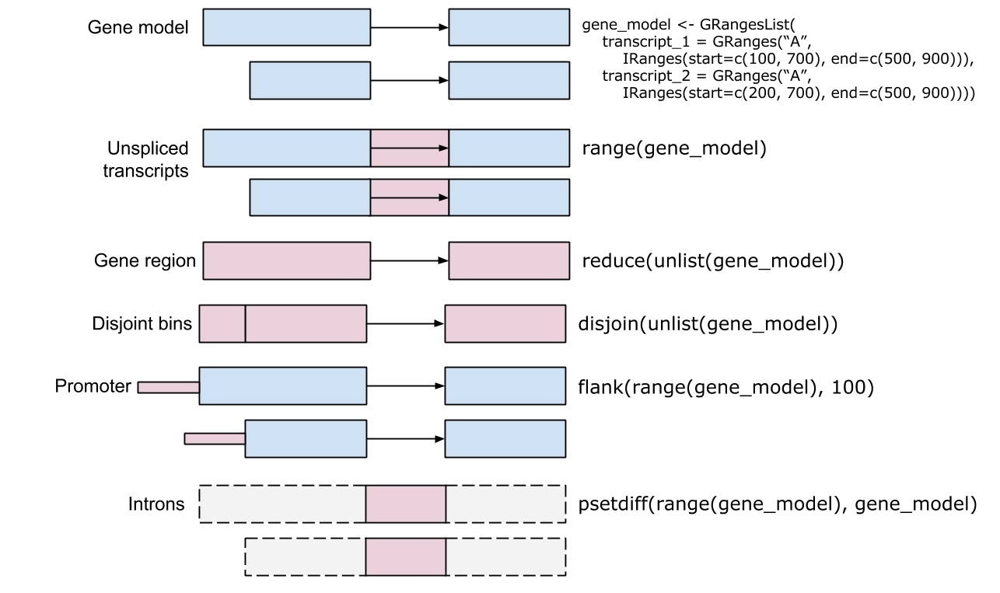

```{r style, echo = FALSE, results = 'asis'}
knitr::opts_chunk$set(
    eval=as.logical(Sys.getenv("KNITR_EVAL", "TRUE")),
    cache=as.logical(Sys.getenv("KNITR_CACHE", "TRUE"))
)
```
```{r setup, echo=FALSE}
suppressPackageStartupMessages({
    library(Biostrings)
    library(GenomicRanges)
    library(GenomicFeatures)
    library(SummarizedExperiment)
    library(SingleCellExperiment)
    library(airway)
    library(plyranges)
    library(iSEE)
    library(TxDb.Dmelanogaster.UCSC.dm6.ensGene)
    library(BSgenome.Dmelanogaster.UCSC.dm6)
    library(matrixStats)
})
```

# DNA Sequences

Representation

- Why not just `character()`?
- What have we got in our object? -- interface versus implementation
- Validation
- Import -- 'fasta' files: `Biostrings::readDNAStringSet()`

    ```{r}
    library(Biostrings)
    fl <- system.file(package="Biostrings", "extdata", "dm3_upstream2000.fa.gz")
    readLines(fl, 6)
    dna <- readDNAStringSet(fl)
    ```

Manipulation

- `length()`, `[` (subset), `[[` (extract), `as.character()` (coerce)
- Many specialized functions

  - `?DNAStringSet` and `vignettes(package="Biostrings")`
  - `ls("package:Biostrings")`
  - `methods(class = "DNAStringSet")`

Biological questions

0. Setup

    - Mouse CDS sequence, from Ensembl: https://useast.ensembl.org/info/data/ftp/index.html
    
    ```{r}
    library(Biostrings)
    url <- "ftp://ftp.ensembl.org/pub/release-92/fasta/mus_musculus/cds/Mus_musculus.GRCm38.cds.all.fa.gz"
    fl <- BiocFileCache::bfcrpath(rnames = url)
    cds <- readDNAStringSet(fl)
    ```

**Exercise**

1. For simplicity, clean up the data to remove cds with width not a multiple of 
   3. Remove cds containing any 'N' nucelotides.
 
    ```{r}
    pred1 <- width(cds) %% 3 == 0
    table(pred1)
    pred2 <- letterFrequency(cds, "N")[, "N"] == 0
    table(pred2)
    table(pred1 & pred2)
    cds <- cds[ pred1 & pred2 ]
    ```
    
2. What does the distribution of widths of the cds look like? Which
   cds has maximum width?

    ```{r}
    hist(log10(width(cds)))
    cds[ which.max(width(cds)) ]
    names(cds)[ which.max(width(cds)) ]
    ```

3. Use `letterFrequency()` to calculate the GC content of each cds;
   visualize the distribution of GC content.

    ```{r}
    gc <- letterFrequency(cds, "GC", as.prob=TRUE)
    head(gc)
    hist(gc)
    plot( log10(width(cds)), gc, pch=".")
    ```

4. Summarize codon usage in each CDS. Which codons are used most
   frequently over all CDS?

    ```{r}
    AMINO_ACID_CODE
    aa <- translate(cds)
    codon_use <- letterFrequency(aa, names(AMINO_ACID_CODE))
    head(codon_use)
    ```

5. (Advanced) -- `DNAStringSet` inherits from `Vector` and
   `Annotated`, which means that each element (sequence) can have
   additional information, for instance we can associate GC content
   with each sequence

    ```{r}
    mcols(cds) <- DataFrame(
        GC = gc[,"G|C"]
    )
    mcols(cds, use.names = FALSE)
    mcols(cds[1:3], use.names = FALSE)
    ```

# Genomic Ranges

Representation

- Chromosome, start, end, (strand)
- What are the start and end coordinates of a range?
- Where do we count from?
- Examples

  - SNPs
  - Peaks (e.g., regulatory regions)
  - Genes
  - Transcripts
  
- import -- `rtracklayer::import()` BED, WIG, GFF, etc.



**Exercises**

1. Which of my SNPs overlap genes?

    ```{r}
    genes <- GRanges(c("chr1:30-40:+", "chr1:60-70:-"))
    snps <- GRanges(c("chr1:35", "chr1:60", "chr1:45"))
    countOverlaps(snps, genes) > 0
    ```

2. Which gene is 'nearest' my regulatory region? Which gene does my
   regulatory region _precede_ (i.e., upstream of)

    ```{r}
    reg <- GRanges(c("chr1:50-55", "chr1:75-80"))
    nearest(reg, genes)
    precede(reg, genes)
    ```

3. What range do short reads cover? depth of coverage?

    ```{r}
    reads <- GRanges(c("chr1:10-19", "chr1:15-24", "chr1:30-41"))
    coverage(reads, width = 100)
    as(coverage(reads, width = 100), "GRanges")
    ```
    
4. Represent gene models

    ```{r}
    library(GenomicFeatures)
    library(TxDb.Dmelanogaster.UCSC.dm6.ensGene)
    
    txdb <- TxDb.Dmelanogaster.UCSC.dm6.ensGene
    genes(txdb)
    exByTx <- exonsBy(txdb, "tx")
    exByTx
    ```
    
    Create a TxDb using `GenomicFeatures::makeTxDbFrom*()`
    
    Play well with DNA sequences
    
    ```{r}
    library(BSgenome.Dmelanogaster.UCSC.dm6)
    getSeq(BSgenome.Dmelanogaster.UCSC.dm6, exons(txdb))
    ```

**Exercise**

Check out the [plyranges][] package!

# Summarized Experiments


Motivation: reproducible & interoperable

- Matrix of feature x sample measurements, `assays()`
- Addition description about samples, `colData()`

  - Covariates, e.g., age, gender
  - Experimental design, e.g., treatment group

- Additional information about features, `rowData()`

  - Gene names, width, GC content, ...
  - Genomic ranges(!)
  - Derived values, E.g., log-fold change between treatments, _P_-value, ...
  
- Information about the experiment as a whole -- `metadata()`

Example One: Bulk RNA-seq `airway` data

- See earlier

    ```{r}
    library(airway)
    data(airway)
    airway
    colData(airway)
    airway[ , airway$dex == "untrt"]
    
    library(matrixStats)
    most_variable <- tail(order(rowVars(assay(airway))), 100)
    airway[ most_variable ,]
    ```

Example 2: single-cell RNA-seq.

- Hemberg lab [scRNA-seq Datasets][] 'Manno' [Mouse brain data set (rds)][]

    ```
    url <- "https://scrnaseq-public-datasets.s3.amazonaws.com/scater-objects/manno_mouse.rds"
    fl <- BiocFileCache::bfcrpath(rnames = url)
    sce <- readRDS(fl)
    ```

**Exercises**

- What's the frequency of 0 counts in the single cell assay data?
- What's the distribution of library sizes in the single cell assay data?
- Create a random sample of 100 cells and visualize the relationship
  between samples using `dist()` and `cmdscale()`.
- can you identify what column of `colData()` is responsible for any
  pattern you see?
- In exploring the covariates, are the possible problems with confounding?

[scRNA-seq Datasets]: https://hemberg-lab.github.io/scRNA.seq.datasets/
[Mouse brain data set (rds)]: https://scrnaseq-public-datasets.s3.amazonaws.com/scater-objects/manno_mouse.rds
[plyranges]: https://bioconductor.org/packages/plyranges
