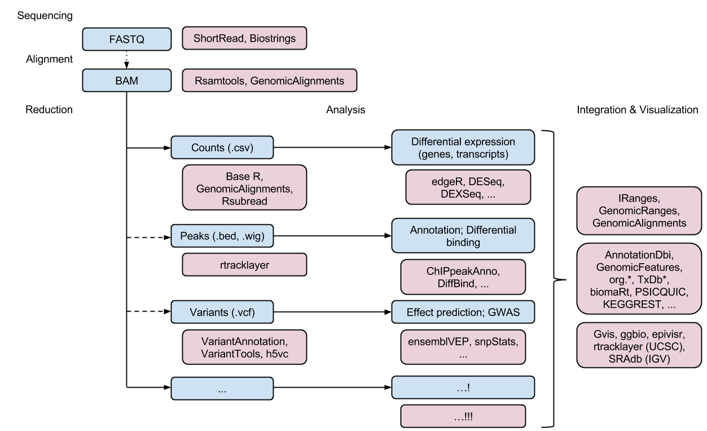

```{r style, echo = FALSE, results = 'asis'}
options(width=100)
knitr::opts_chunk$set(
    eval=as.logical(Sys.getenv("KNITR_EVAL", "TRUE")),
    cache=as.logical(Sys.getenv("KNITR_CACHE", "TRUE")))
```

```{r setup, echo=FALSE}
suppressPackageStartupMessages({
    library(Biostrings)
    library(GenomicRanges)
    library(SummarizedExperiment)
    library(airway)
    library(rtracklayer)
    library(ShortRead)
    library(GenomicAlignments)
    library(RNAseqData.HNRNPC.bam.chr14)
    library(VariantAnnotation)
})
```

# Project Overview

## About

[Bioconductor][]: Analysis and comprehension of high-throughput
genomic data

- Statistical analysis: large data, technological artifacts, designed
  experiments; rigorous
- Comprehension: biological context, visualization, reproducibility
- High-throughput
    - Sequencing: RNASeq, ChIPSeq, variants, copy number, ...
    - Microarrays: expression, SNP, ...
    - Flow cytometry, proteomics, images, ...

Packages, vignettes, work flows

- 1296 software packages; also...
    - 'Annotation' packages -- static data bases of identifier maps,
      gene models, pathways, etc; e.g., [TxDb.Hsapiens.UCSC.hg19.knownGene][]
    - 'Experiment packages -- data sets used to illustrate software
      functionality, e.g., [airway][]
- Discover and navigate via [biocViews][]
- Package 'landing page'
    - Title, author / maintainer, short description, citation,
      installation instructions, ..., download statistics
- All user-visible functions have help pages, most with runnable
  examples
- 'Vignettes' an important feature in Bioconductor -- narrative
  documents illustrating how to use the package, with integrated code
- 'Release' (every six months) and 'devel' branches
- [Support site](https://support.bioconductor.org);
  [videos](https://www.youtube.com/user/bioconductor), [recent
  courses](https://bioconductor.org/help/course-materials/)

Package installation and use

- A package needs to be installed once, using the instructions on the
  package landing page (e.g., [DESeq2][]).

    ```{r install, eval=FALSE}
    source("https://bioconductor.org/biocLite.R")
    biocLite(c("DESeq2", "org.Hs.eg.db"))
    ```

- `biocLite()` installs _Bioconductor_, [CRAN][], and github packages.

- Once installed, the package can be loaded into an R session

    ```{r require}
    library(GenomicRanges)
    ```

    and the help system queried interactively, as outlined above:

    ```{r help-bioc, eval=FALSE}
    help(package="GenomicRanges")
    vignette(package="GenomicRanges")
    vignette(package="GenomicRanges", "GenomicRangesHOWTOs")
    ?GRanges
    ```

## Key concepts

Goals

- Reproducibility
- Interoperability
- Use

What a few lines of _R_ has to say

```{r five-lines}
x <- rnorm(1000)
y <- x + rnorm(1000)
df <- data.frame(X=x, Y=y)
plot(Y ~ X, df)
fit <- lm(Y ~ X, df)
anova(fit)
abline(fit)
```

Classes and methods -- "S3"

- `data.frame()`
  - Defines _class_ to coordinate data
  - Creates an _instance_ or _object_

- `plot()`, `lm()`, `anova()`, `abline()`: _methods_ defined on
  _generics_ to transform instances

- Discovery and help

    ```{r help-r, eval=FALSE}
    class(fit)
    methods(class=class(fit))
    methods(plot)
    ?"plot"
    ?"plot.formula"
    ```

- tab completion!

_Bioconductor_ classes and methods -- "S4"

- Example: working with DNA sequences

    ```{r classes-and-methods}
    library(Biostrings)
    dna <- DNAStringSet(c("AACAT", "GGCGCCT"))
    reverseComplement(dna)
    ```

    ```{r}
    data(phiX174Phage)
    phiX174Phage
    letterFrequency(phiX174Phage, "GC", as.prob=TRUE)
    ```

- Discovery and help

    ```{r classes-and-methods-discovery, eval=FALSE}
    class(dna)
    ?"DNAStringSet-class"
    ?"reverseComplement,DNAStringSet-method"
    ```

## High-throughput sequence analysis work flows

1. Experimental design

2. Wet-lab sequence preparation (figure from http://rnaseq.uoregon.edu/)

    

3. (Illumina) Sequencing (Bentley et al., 2008,
   doi:10.1038/nature07517)

    

    - Primary output: FASTQ files of short reads and their [quality
      scores](http://en.wikipedia.org/wiki/FASTQ_format#Encoding)

4. Alignment
    - Choose to match task, e.g., [Rsubread][], Bowtie2 good for ChIPseq,
      some forms of RNAseq; BWA, GMAP better for variant calling
    - Primary output: BAM files of aligned reads
    - More recently: [kallisto][] and similar programs that produce
      tables of reads aligned to transcripts
5. Reduction
    - e.g., RNASeq 'count table' (simple spreadsheets), DNASeq called
      variants (VCF files), ChIPSeq peaks (BED, WIG files)
6. Analysis
    - Differential expression, peak identification, ...
7. Comprehension
    - Biological context

## _Bioconductor_ sequencing ecosystem




[Bioconductor]: https://bioconductor.org
[CRAN]: https://cran.r-project.org
[biocViews]: https://bioconductor.org/packages/

[HDF5Array]: https://bioconductor.org/packages/HDF5Array
[AnnotationDbi]: https://bioconductor.org/packages/AnnotationDbi
[AnnotationHub]: https://bioconductor.org/packages/AnnotationHub
[BSgenome.Hsapiens.UCSC.hg19]: https://bioconductor.org/packages/BSgenome.Hsapiens.UCSC.hg19
[BSgenome]: https://bioconductor.org/packages/BSgenome
[BiocParallel]: https://bioconductor.org/packages/BiocParallel
[Biostrings]: https://bioconductor.org/packages/Biostrings
[CNTools]: https://bioconductor.org/packages/CNTools
[ChIPQC]: https://bioconductor.org/packages/ChIPQC
[ChIPseeker]: https://bioconductor.org/packages/ChIPseeker
[DESeq2]: https://bioconductor.org/packages/DESeq2
[DiffBind]: https://bioconductor.org/packages/DiffBind
[GenomicAlignments]: https://bioconductor.org/packages/GenomicAlignments
[GenomicFeatures]: https://bioconductor.org/packages/GenomicFeatures
[GenomicFiles]: https://bioconductor.org/packages/GenomicFiles
[GenomicRanges]: https://bioconductor.org/packages/GenomicRanges
[Gviz]: https://bioconductor.org/packages/Gviz
[Homo.sapiens]: https://bioconductor.org/packages/Homo.sapiens
[IRanges]: https://bioconductor.org/packages/IRanges
[KEGGREST]: https://bioconductor.org/packages/KEGGREST
[OmicCircos]: https://bioconductor.org/packages/OmicCircos
[PSICQUIC]: https://bioconductor.org/packages/PSICQUIC
[Rsamtools]: https://bioconductor.org/packages/Rsamtools
[Rsubread]: https://bioconductor.org/packages/Rsubread
[ShortRead]: https://bioconductor.org/packages/ShortRead
[SomaticSignatures]: https://bioconductor.org/packages/SomaticSignatures
[SummarizedExperiment]: https://bioconductor.org/packages/SummarizedExperiment
[TxDb.Hsapiens.UCSC.hg19.knownGene]: https://bioconductor.org/packages/TxDb.Hsapiens.UCSC.hg19.knownGene
[VariantAnnotation]: https://bioconductor.org/packages/VariantAnnotation
[VariantFiltering]: https://bioconductor.org/packages/VariantFiltering
[VariantTools]: https://bioconductor.org/packages/VariantTools
[airway]: https://bioconductor.org/packages/airway
[biomaRt]: https://bioconductor.org/packages/biomaRt
[cn.mops]: https://bioconductor.org/packages/cn.mops
[csaw]: https://bioconductor.org/packages/csaw
[edgeR]: https://bioconductor.org/packages/edgeR
[ensemblVEP]: https://bioconductor.org/packages/ensemblVEP
[epivizr]: https://bioconductor.org/packages/epivizr
[ggbio]: https://bioconductor.org/packages/ggbio
[h5vc]: https://bioconductor.org/packages/h5vc
[limma]: https://bioconductor.org/packages/limma
[metagenomeSeq]: https://bioconductor.org/packages/metagenomeSeq
[org.Hs.eg.db]: https://bioconductor.org/packages/org.Hs.eg.db
[org.Sc.sgd.db]: https://bioconductor.org/packages/org.Sc.sgd.db
[phyloseq]: https://bioconductor.org/packages/phyloseq
[rtracklayer]: https://bioconductor.org/packages/rtracklayer
[snpStats]: https://bioconductor.org/packages/snpStats

[dplyr]: https://cran.r-project.org/package=dplyr
[data.table]: https://cran.r-project.org/package=data.table
[Rcpp]: https://cran.r-project.org/package=Rcpp
[kallisto]: https://pachterlab.github.io/kallisto
