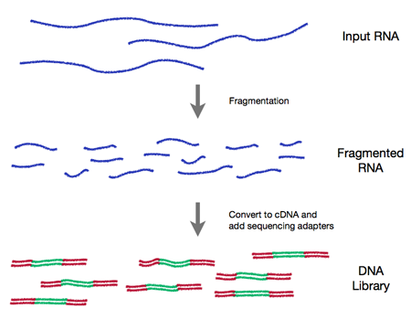

```{r style, echo = FALSE, results = 'asis'}
options(width=100)
knitr::opts_chunk$set(
    eval=as.logical(Sys.getenv("KNITR_EVAL", "TRUE")),
    cache=as.logical(Sys.getenv("KNITR_CACHE", "TRUE"))
)
suppressPackageStartupMessages({
    library(TENxGenomics)
    library(SummarizedExperiment)
    library(matrixStats)
    library(DESeq2)
})
```

This workshop provides some ideas for 'looking at' data during
statistical analysis.  During the workshop, we will look at a moderate
sized RNA-seq gene expression data set, discovering basic problems
with the data and exploring possible solutions. The skills explored
are relevant in many other areas of statistical data analysis.

The workshop is designed for those with some familiarity with the _R_
programming langauge for statistical analysis, and with the _RStudio_
environment.

# Basics

Vector, data.frame, matrix

Packages

Help!

# Looking at data

## RNA-seq

- Wet-lab sequence preparation (figure from http://rnaseq.uoregon.edu/)

    

- (Illumina) Sequencing (Bentley et al., 2008, doi:10.1038/nature07517)

   

- 'Reduction' to feature (gene) x sample count matrix

## Data exploration

Data input

```{r}
fl <- "data/airway_colData.csv"
colData <- read.csv(fl, row.names=1)
colData
```

```{r}
fl <- "data/airway_counts.csv"
counts <- read.csv(fl, row.names=1)
counts <- as.matrix(counts)
dim(counts)
head(counts)
```

Distribution of counts

Library sizes and normalization

Mean / variance relationship

Filtering

Data modelling

## A more robust work flow

'Rich' data -- [SummarizedExperiment][] package,
`SummarizedExperiment()`


[DESeq2][] work flow -- `DESeq2()`

# Looking ahead: large single-cell RNA-seq data sets

Single-cell RNA-seq

- Much larger data sets
- What does it 'look like'?

Management

- Leading edge
- [10xGenomics][] data set: 1.3 million cells, hdf5 data
- [TENxGenomics][] package

```{r}
library(rhdf5)
fl <- "data/1M_neurons_filtered_gene_bc_matrices_h5.h5"
h5ls(fl)
```

Reference, subset, input

```{r}
library(TENxGenomics)
tenx <- TENxGenomics(fl)
tenx
onek <- tenx[, sample(ncol(tenx), 1000)]
m <- as.matrix(onek)
```

Basics

- Sparse!

Library size

Mean / variance relationship

[SummarizedExperiment]: https://bioconductor.org/packages/SummarizedExperiment
[DESeq2]: https://bioconductor.org/packages/DESeq2
[10xGenomics]: https://support.10xgenomics.com/single-cell/datasets/1M_neurons
[TENxGenomics]: https://github.com/mtmorgan/TENxGenomics
